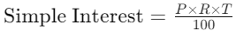

# 3.2-Functions-print-and-return

Sure! Here are **ten functions** for practicing different aspects of Python function writing. They cover a variety of topics, including functions with parameters, return values, print statements, and no parameters.

---

### 1. **Calculate Circle Area**
Write a function `calculate_circle_area(radius)` that takes the radius of a circle and returns the area of the circle. pi is 3.14

```python

def calculate_circle_area(radius):
    # your code here

# Example call:
area = calculate_circle_area(3)
print("Circle Area:", area)
```

---

### 2. **Print Greeting Message**
Write a function `print_greeting()` that prints a greeting message. This function does not take any parameters.

```python
def print_greeting():
    # your code here

# Example call:
print_greeting()
```

---

Here’s an additional function that takes two players' scores and announces the winner:

---

### 3. **Announce Winner**
Write a function `announce_winner(player1_name, player1_score, player2_name, player2_score)` that takes the names and scores of two players and announces the winner. If the scores are tied, announce that it's a draw.

```python
def announce_winner(player1_name, player1_score, player2_name, player2_score):
    if player1_score > player2_score:
        print(f"{player1_name} wins with a score of {player1_score}!")
    elif player1_score < player2_score:
        print(f"{player2_name} wins with a score of {player2_score}!")
    else:
        print(f"It's a tie! Both {player1_name} and {player2_name} have {player1_score} points.")

# Example call:
announce_winner("Alice", 85, "Bob", 92)
```


---

### 4. **Simple Interest Calculator**
Write a function `calculate_simple_interest(principal, rate, time)` that calculates the simple interest using the formula:  


```python
def calculate_simple_interest(principal, rate, time):
    # your code here

# Example call:
interest = calculate_simple_interest(1000, 5, 3)
print("Simple Interest:", interest)
```

---

### 8. **Roll A Die**
Write a function `roll_two_dice()` that simulates rolling two six-sided dice and returns their sum.


```python
import random

def roll__die():
    # your code here

# Example call:
total = roll_die()
print("Total of two dice rolls:", total)
```

---

### 10. **Convert Minutes to Hours and Minutes**
Write a function `convert_minutes(minutes)` that converts a number of minutes into hours and minutes and prints the result.

```python
def convert_minutes(minutes):
    hours = minutes // 60
    mins = minutes % 60
    print(f"{minutes} minutes is {hours} hours and {mins} minutes.")

# Example call:
convert_minutes(135)
```

